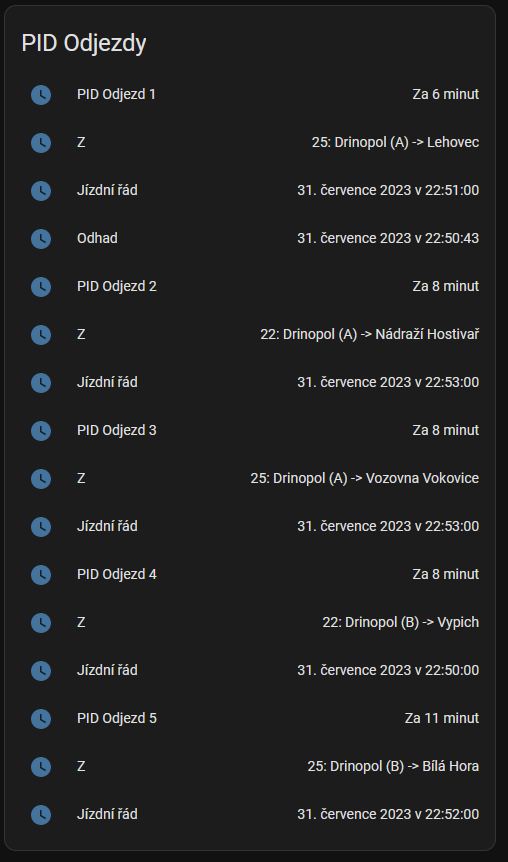

# Integrace jízdních řádů Pražské integrované dopravy (PID)
(English translation below)

Cílem této integrace je možnost zobrazení jízdních řádů PID ve vašem Home Assistantovi - ať už pro zobrazení na dashboardu, na nějakém externím displeji nebo případně k vytvoření automatizací.

Doplněk pracuje velmi jednoduše - v nastavení si zadáte, které zastávky chcete sledovat, načež integrace periodicky stahuje data z rozhraní PIDu a vytvoří 5 entit, které odpovídají příštím pěti spojům z daných zastávek. 

Příkladem budiž:



## Postup instalace 
1. Stáhněte si doplněk z HACS - TODO!!

## Vzorový příklad nastavení Lovelace
Tento vzorový příklad nastavení karty Entity zobrazí všech 5 odjezdů a u každého detail a plánovaný čas příjezdu.
```
type: entities
entities:
  - sensor.pid_odjezd_1
  - type: attribute
    entity: sensor.pid_odjezd_1
    name: Z
    attribute: details
  - type: attribute
    entity: sensor.pid_odjezd_1
    name: Jízdní řád
    attribute: scheduled
  - type: attribute
    entity: sensor.pid_odjezd_1
    name: Odhad
    attribute: predicted
  - sensor.pid_odjezd_2
  - type: attribute
    entity: sensor.pid_odjezd_2
    name: Z
    attribute: details
  - type: attribute
    entity: sensor.pid_odjezd_2
    name: Jízdní řád
    attribute: scheduled
  - sensor.pid_odjezd_3
  - type: attribute
    entity: sensor.pid_odjezd_3
    name: Z
    attribute: details
  - type: attribute
    entity: sensor.pid_odjezd_3
    name: Jízdní řád
    attribute: scheduled
  - sensor.pid_odjezd_4
  - type: attribute
    entity: sensor.pid_odjezd_4
    name: Z
    attribute: details
  - type: attribute
    entity: sensor.pid_odjezd_4
    name: Jízdní řád
    attribute: scheduled
  - sensor.pid_odjezd_5
  - type: attribute
    entity: sensor.pid_odjezd_5
    name: Z
    attribute: details
  - type: attribute
    entity: sensor.pid_odjezd_5
    name: Jízdní řád
    attribute: scheduled
title: PID Odjezdy

```