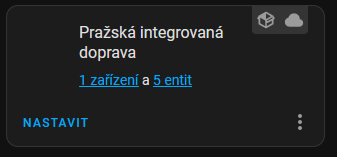
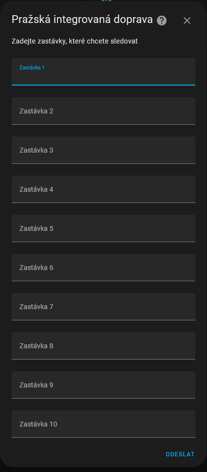
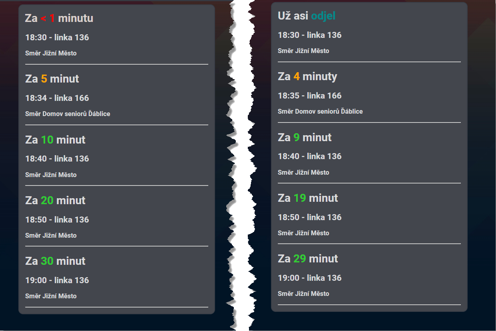

# Integrace jízdních řádů Pražské integrované dopravy (PID)
[](https://github.com/hacs/integration)

(English translation below)

Cílem této integrace je možnost zobrazení jízdních řádů PID ve vašem Home Assistantovi - ať už pro zobrazení na dashboardu, na nějakém externím displeji nebo případně k vytvoření automatizací.

Doplněk pracuje velmi jednoduše - v nastavení si zadáte, které zastávky chcete sledovat, načež integrace periodicky stahuje data z rozhraní PIDu a vytvoří 5 entit, které odpovídají příštím pěti spojům z daných zastávek. 

Příkladem budiž:


## Postup instalace 
1. Je třeba si vygenerovat vlastní API klíč z webu Golemio provozovaného Prahou.
    * Nejdřív se zaregistrujte na https://api.golemio.cz/api-keys/auth/sign-in
    * Následně na stránce https://api.golemio.cz/api-keys/dashboard klikněte na VYGENEROVAT NOVÝ a vygenerovaný klíč si někam zkopírujte, bude se hodit vzápětí.
2. Stažení integrace pomocí HACS
    1. Spustit HACS, případně [nainstalovat](https://hacs.xyz/), pokud ještě nemáte
    2. Vlastní repozitáře
    3. Přidat tento repozitář - https://github.com/jakubcermak/homeassistant-prazska-integrovana-doprava , kategorie Integrace
    4. Měl by se zobrazit tento nový repozitář v HACS, klikněte na něj a dejte "stáhnout"
3. Restart HA
4. V Nastavení - Integrace zvolte Přidat integraci a vyberte "Pražská  Integrovaná Doprava"
5. Do pole API klíč vložte API klíč z kroku 1 a potvrďte.
6. Integrace PID by se měla objevit v seznamu zařízení: 

    
7. V nastavení integrace zadejte jednu až 10 zastávek, které chcete sledovat. POZOR - názvy zastávek je třeba zadat naprosto přesně, použijte např IDOS

    
8. Potvrdit a pokud jste zadali všechny zastávky správně, po cca minutě by se měly entity naplnit údaji o odjezdech ze zvolené zastávky.

Užívejte s radostí.

## Troubleshooting
Pokud něco nefunguje, nejdříve se podívejte do logu HA. Zkontrolujte, jestli je API klíč zadán správně. Zkontrolujde, že máte připojení k internetu. Zkontrolujde přesné názvy zastávek. Pokud si ani tak nevíte rady, založte prosím issue na githubu, zkusím se tomu pověnovat.


Pomoc je vždy vítána, pokud chcete něco zlepšít nebo opravit, prosím založte pull request.

## Vzorový příklad nastavení Lovelace
Tento vzorový příklad nastavení karty Entity zobrazí všech 5 odjezdů a u každého detail a plánovaný čas příjezdu.
```
type: entities
entities:
  - sensor.pid_odjezd_1
  - type: attribute
    entity: sensor.pid_odjezd_1
    name: Z
    attribute: details
  - type: attribute
    entity: sensor.pid_odjezd_1
    name: Jízdní řád
    attribute: scheduled
  - type: attribute
    entity: sensor.pid_odjezd_1
    name: Odhad
    attribute: predicted
  - sensor.pid_odjezd_2
  - type: attribute
    entity: sensor.pid_odjezd_2
    name: Z
    attribute: details
  - type: attribute
    entity: sensor.pid_odjezd_2
    name: Jízdní řád
    attribute: scheduled
  - sensor.pid_odjezd_3
  - type: attribute
    entity: sensor.pid_odjezd_3
    name: Z
    attribute: details
  - type: attribute
    entity: sensor.pid_odjezd_3
    name: Jízdní řád
    attribute: scheduled
  - sensor.pid_odjezd_4
  - type: attribute
    entity: sensor.pid_odjezd_4
    name: Z
    attribute: details
  - type: attribute
    entity: sensor.pid_odjezd_4
    name: Jízdní řád
    attribute: scheduled
  - sensor.pid_odjezd_5
  - type: attribute
    entity: sensor.pid_odjezd_5
    name: Z
    attribute: details
  - type: attribute
    entity: sensor.pid_odjezd_5
    name: Jízdní řád
    attribute: scheduled
title: PID Odjezdy

```
## Příklad nastavení Lovelace s vlastní grafikou
Další příklad nastavení karty Markdown, která  zobrazí a naformátuje všech 5 odjezdů, zbývající čas, linku a směr.

```
type: markdown
content: >
  
  
  {{ '<font color=limegreen>' }}
  
  {{ '<font color=orange>' }}
  
  {{ '<font color=red>' }}
  
  {{ '<font color=darkcyan>' }}
  
  

  
  ---
  

  
  
  {% set hod = diff | timestamp_custom('%H', false) | int %}
  {% set min = diff | timestamp_custom('%M', false) | int %}
  
  

  
  # Už asi {{c1}}odjel{{c2}}
  
  # Za  {{c1}}  {{hod}}{{c2}} hodinu  {{hod}}{{c2}} hodiny {{hod}}{{c2}} hodin  {{c1}} {{lo}} 1 {{c2}}minutu {{min}}{{c2}} minutu  {{min}}{{c2}} minuty {{min}}{{c2}} minut</font> 

  ## {{ as_timestamp(state_attr(PIDodjezd.entity_id, 'predicted')) |
  timestamp_custom('%H:%M') }} - linka {{ state_attr(PIDodjezd.entity_id,
  'linenumber') }}

  ### Směr {{ state_attr(PIDodjezd.entity_id, 'stop_to') }}

  ---
  
title: PID Odjezdy

```
